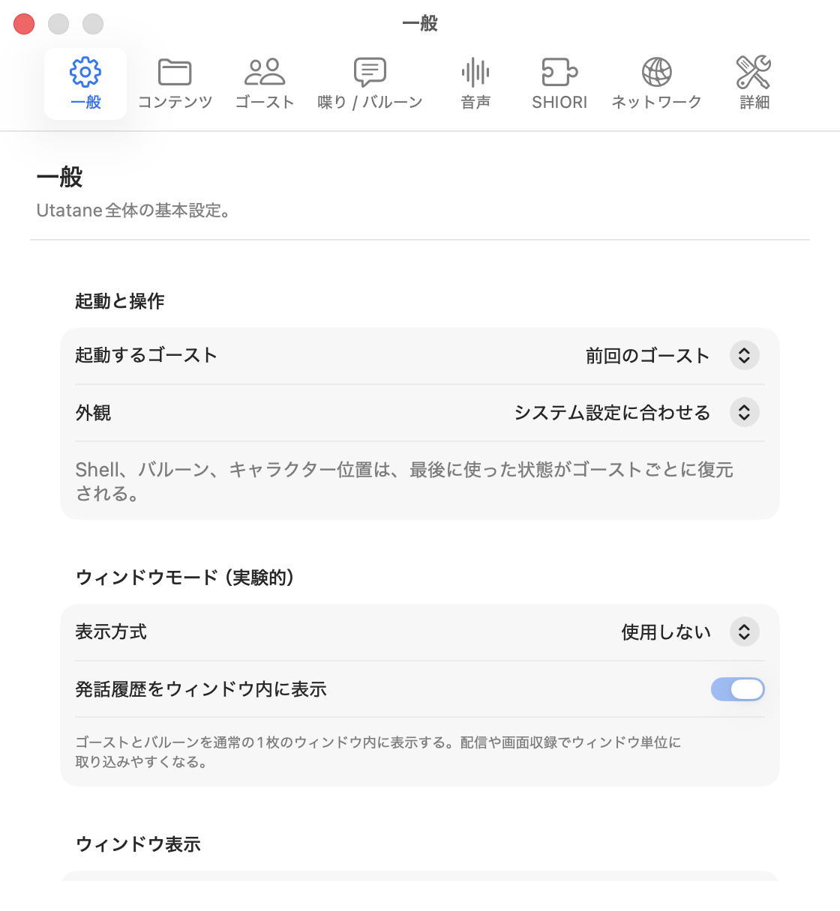

# ドキュメントへの貢献

Utataneの説明を追加・修正する人向けの手順です。

## 原稿の構成

- `Docs/Guide/`: インストール、操作、設定など、アプリを使う人向けの説明
- `Docs/Support/`: トラブル対処と互換性
- `Docs/Creators/`: ゴースト、SHIORI、シェル、プラグインを作る人向けの説明
- `Docs/Reference/`: 命令、イベント、設定ファイルなどの対応表
- `Docs/Development/`: Utatane本体をローカルで開発・改変する人向けの説明
- `Docs/navigation.json`: Web版へ公開するページ、URL、目次、同梱対象

`Docs/Index.md`はWeb版の入口、`Docs/README.md`はリポジトリ内の索引です。`website/`はAstroとStarlightを使い、これらの原稿から静的サイトを生成します。

アプリに同梱する`apps/Utatane/Resources/UtataneHelp.html`も同じ原稿から生成します。このHTMLは直接編集しないでください。

## ローカルで確認する

Node.js 22.12以降とBunを使います。

```sh
cd website
bun install --frozen-lockfile
bun run help
bun run check
bun run build
bun run test
bun run preview --host 127.0.0.1
```

執筆中は`bun run dev`でも確認できます。Docsを追加・移動した場合は、開発サーバーを再起動して原稿を読み込み直してください。検索は本番ビルド後のpreviewで確認します。

`bun run check`は翻訳キー、原稿内リンク、Issueの参照先、リリース取得処理、同梱ヘルプの生成差分を検査します。`bun run test`は生成したページ、内部リンク、アセット、同梱ヘルプのアンカーなどを検査します。表示、検索、スタイル切り替えはブラウザでも確認してください。

## ページを追加する

1. 用途に合う`Docs/`のフォルダへMarkdownを追加し、先頭を`# ページ名`にします。
2. `Docs/navigation.json`へ`file`、`slug`、`title`を追加します。アプリの利用者向けで、同梱ヘルプにも載せるページには`help: true`を指定します。
3. 原稿間は相対Markdownリンクでつなぎます。
4. `bun run help`で同梱ヘルプを再生成します。
5. `bun run check`と`bun run test`を実行し、原稿と生成済みHTMLを一緒にコミットします。

同梱対象ではない制作・開発ページへのリンクは、同梱ヘルプからWeb版へ案内されます。原稿を移動した場合は、ほかの原稿、`Docs/README.md`、Issueテンプレートからのリンクも更新してください。

## 紹介サイトを編集する

紹介サイトは`website/src/`にあります。言語別の本文は`website/src/data/{ja,en,zh-Hans,zh-Hant,ko}.json`で管理しています。項目を追加する場合は同じ翻訳キーを5言語へ追加してください。

ドキュメントの見た目は`website/src/styles/docs.css`、同梱ヘルプは`website/src/styles/help.css`で調整します。紹介サイトとドキュメントは別のデザインです。ガラス風とクラシック98風の切り替えでも、本文の読みやすさと操作性を保ってください。

## スクリーンショットを追加する

画像は`website/public/assets/screenshots/`へ置き、原稿から相対Markdownリンクで参照します。例えば`Docs/Guide/`の原稿では次のように書きます。

```md

```

Web版では画像URLへ、同梱ヘルプでは埋め込み画像へ変換されます。設定画面の画像はスクロール領域の一部しか写らないことがあるため、画像だけに説明を任せず、写っていない項目も本文で案内してください。
