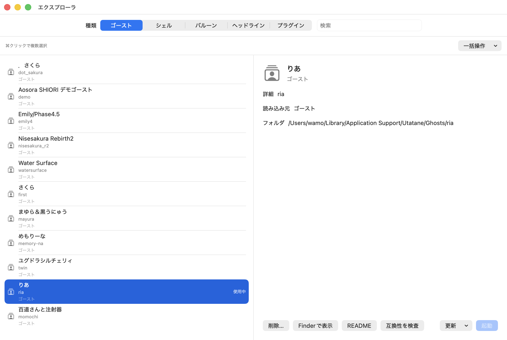

# コンテンツを管理する

## NARを追加する

次の方法でNARファイルをインストールできます。

- キャラクターへNARファイルをドラッグ＆ドロップします。
- 右クリックの「機能」→「コンテンツ管理」→「NARをインストール…」からファイルを選びます。
- Finderの「このアプリケーションで開く」でUtataneを選びます。

NARにはゴースト以外に、シェル、バルーン、ヘッドライン、プラグインなどが入っている場合があります。インストールできることと、内包するWindows用モジュールが動作することは別です。

## SSPから取り込む

「機能」→「コンテンツ管理」→「SSPフォルダから取り込む…」で、展開済みのSSPフォルダを選びます。ゴーストとバルーンを取り込めます。SSP本体をUtataneが実行する仕組みではありません。

取り込んだゴーストにWindows専用のSHIORI・SAORIが含まれる場合は、[対応範囲](../Support/Native-SHIORI.md)を確認してください。

## エクスプローラを使う

右クリックの「機能」→「エクスプローラ」、またはメニューバーの「操作」→「エクスプローラ」から開きます。

1. 上部でゴースト、シェル、バルーンなどの種類を選びます。
2. 数が多い場合は、検索欄に名前を入力して絞り込みます。
3. 左の一覧から選ぶと、右に説明と操作ボタンが表示されます。

選んだ項目に応じて、切り替え、ネットワーク更新、README・配布元・Finderでの表示、アンインストールができます。画像の一覧やフォルダは撮影環境の例です。

## コンテンツを更新する

右クリックの「ネットワーク更新」やエクスプローラから、更新情報を持つコンテンツを更新できます。エクスプローラでは個別・一括更新を扱えます。

ゴーストとバルーンの自動更新は「設定」→「ネットワーク」で有効にし、確認する日数を選びます。RSSの巡回やUtatane本体の更新とは別の設定です。

古い配布元のHTTP更新も利用できますが、HTTPSと同じ通信保護はありません。信頼する配布元を使ってください。更新できない場合の確認順は[困ったとき](../Support/Troubleshooting.md)にあります。

## 削除する

右クリックの「アンインストール」やエクスプローラから削除します。Utataneが安全に削除できる管理対象の場所にある項目に限ります。追加した読み込みフォルダなどでは、削除が利用できない場合があります。

会話の記録や名前など、ゴーストが保存するデータもフォルダ内に含まれる場合があります。残したいデータは[バックアップ](Storage.md)してから削除してください。

## 読み込みフォルダを追加する

「Utatane設定」→「コンテンツ」で、種類ごとの読み込みフォルダ、有効・無効、優先順位、インストール先を管理できます。変更後は画面の案内に従ってUtataneを再起動します。
