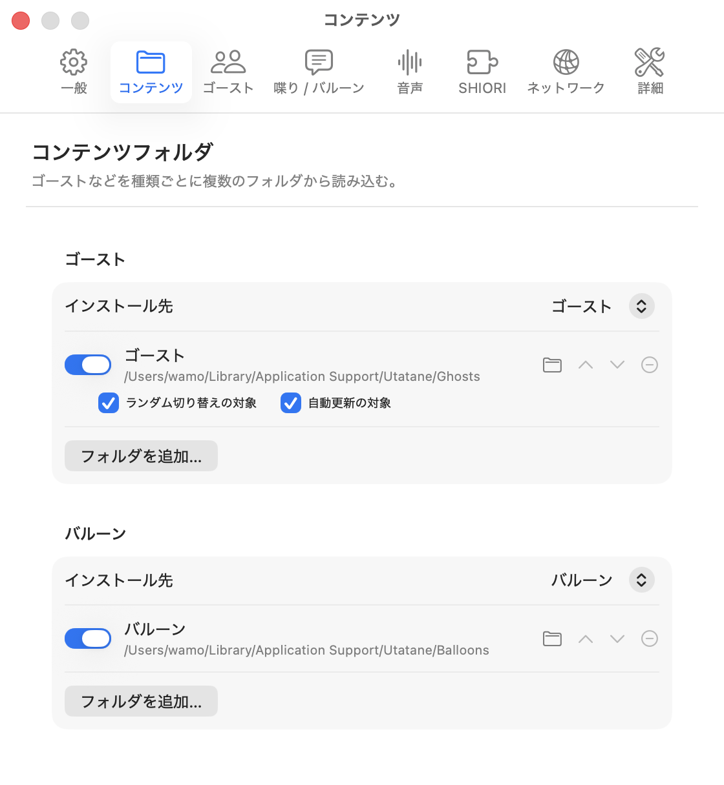
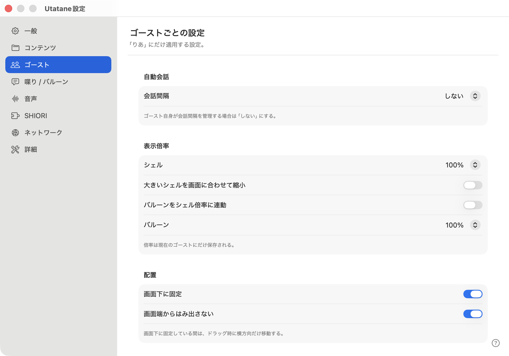
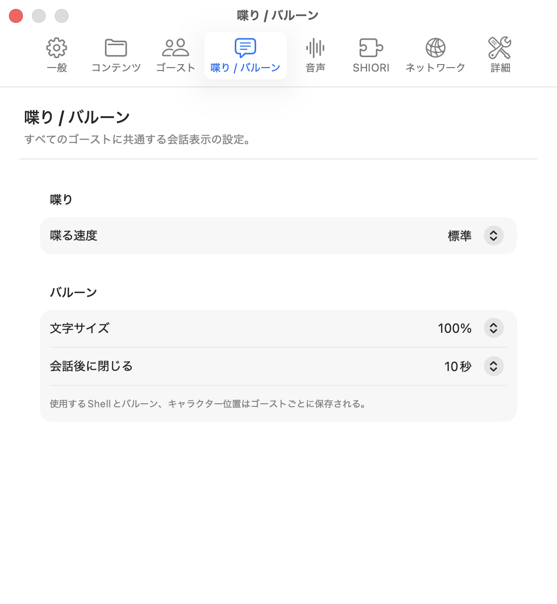
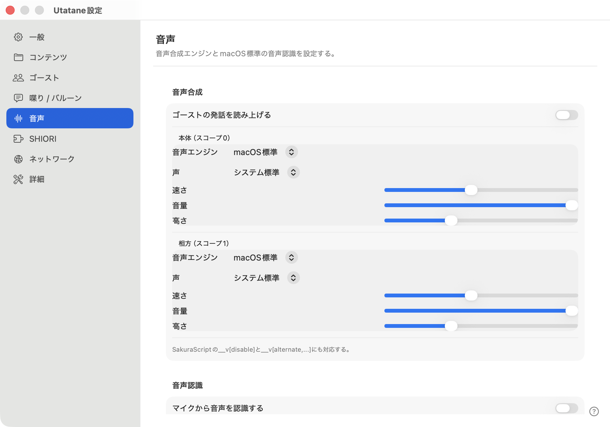
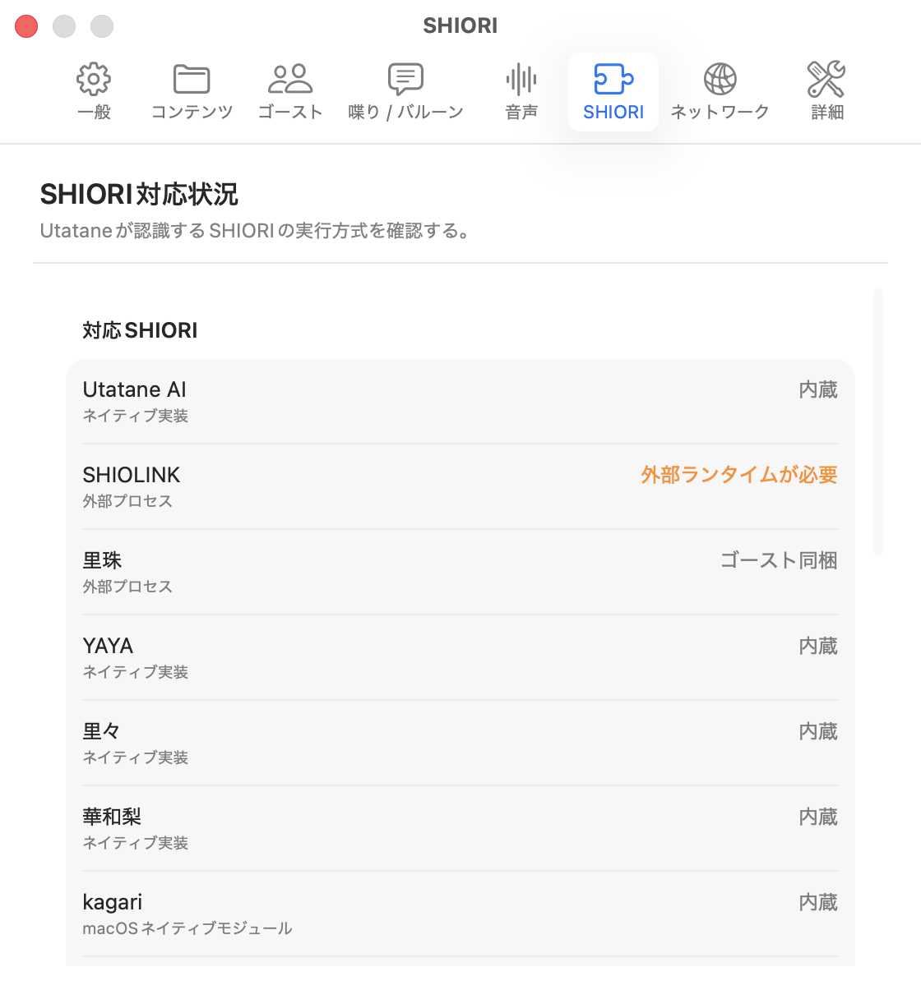
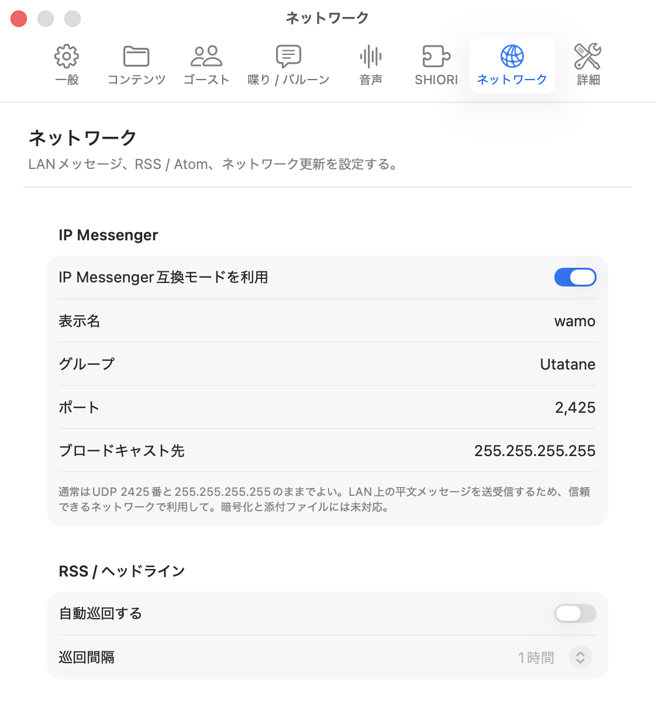
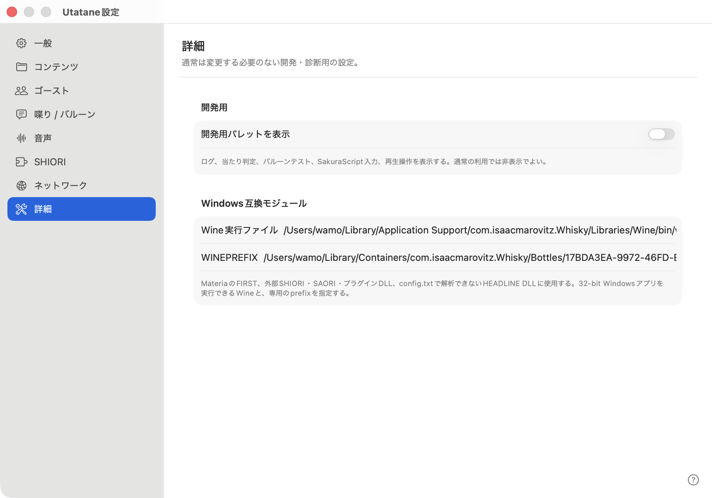

# 設定を調整する

メニューバーの「Utatane」→「設定…」、または右クリックの「設定」→「本体設定」から開きます。設定する内容は、画面左側のサイドバーから選びます。右クリックの「設定」→「設定画面」から、目的のカテゴリへ直接移動することもできます。

以下の画像は各カテゴリに表示される**設定内容の一部**です。設定ウィンドウの高さが限られるため、すべての項目は写っていません。画像にない項目は画面を下へスクロールして確認してください。選択値やスイッチの状態は撮影時の例です。

## 一般

| 項目 | 効果・適用範囲 |
| --- | --- |
| 起動するゴースト | 前回のゴーストを復元、起動時に選択、ランダムから選びます。本体共通で、次の起動に使います |
| 外観 | システム設定に合わせる、ライト、ダーク。本体共通です |
| Dockにアプリアイコンを表示 | 無効にするとDockからUtataneを隠します。設定や終了などの操作はMenuBarのUtataneアイコンから開けます |
| ウィンドウモード | 通常の個別表示、全ゴーストを1枚、ゴーストごとに1枚。[詳細](Window-Mode.md) |
| 発話履歴をウィンドウ内に表示 | ウィンドウモードの下部に履歴を統合します。モードが無効な間は変更できません |
| 手前に表示 | 常に、発話中だけ、通常のウィンドウと同じ、から選びます |
| 再生中の曲情報をゴーストに通知 | macOSの「再生中」にある曲の変化を通知します。反応にはゴースト側の対応が必要です |
| 表示言語 | 本体UIの言語。再起動後に反映します。ゴーストの会話を翻訳する設定ではありません |
| 既定のバルーン | ゴースト自身と過去の選択に指定がない場合のバルーンです |
| 最近使ったもの | 右クリックメニューに保存する利用履歴の最大件数です |

## コンテンツ

読み込みフォルダを種類ごとに登録し、優先順位、有効・無効、インストール先を選びます。変更には再起動が必要です。[コンテンツ管理](Content.md)と[保存場所](Storage.md)を参照してください。

## ゴースト

現在のゴーストに適用します。倍率や配置などはゴーストごとに保存します。

| 項目 | 効果・注意点 |
| --- | --- |
| 会話間隔 | 本体から自動会話を要求する間隔。ゴースト自身が間隔を管理する場合は「しない」を選びます |
| シェル倍率 | キャラクターの表示サイズです |
| 大きいシェルを画面に合わせて縮小 | 大きすぎるサーフェスを画面に収めます |
| バルーンをシェル倍率に連動 | 有効な間はバルーンの個別倍率を変更できません |
| バルーン倍率 | 吹き出し全体の表示サイズ。文字サイズとは別です |
| 画面下に固定 | キャラクターを下側へ固定します。ドラッグは横方向だけになります |
| 画面端からはみ出さない | 画面の外へ出ないように配置を補正します |

## 喋り / バルーン

すべてのゴーストに共通する表示設定です。「喋る速度」は文字の表示間隔、「文字サイズ」は吹き出し内の文字倍率、「会話後に閉じる」は会話終了後の表示時間です。

シェル・バルーンの選択と位置はゴーストごとに保存します。ゴースト自身のSakuraScriptやバルーン定義によって、待ち時間・文字装飾などが指定される場合もあります。

## 音声

発話の読み上げを有効にし、本体（スコープ0）と相方（スコープ1）のエンジンや声を設定します。音声認識は認識言語とデバイス上での認識を選べます。初回はmacOSのマイク・音声認識の許可が必要です。[エンジン別の設定](Speech.md)を参照してください。

## SHIORI

人格エンジンの認識・実行方式を確認する画面です。通常の利用で辞書を書き換える必要はありません。動かないゴーストの確認には[SHIORI・SAORIの対応範囲](../Support/Native-SHIORI.md)を使います。

## ネットワーク

| まとまり | 設定すること |
| --- | --- |
| IP Messenger | 有効化、表示名、グループ、UDPポート、ブロードキャスト先。[詳細](IP-Messenger.md) |
| RSS / ヘッドライン | 自動巡回の有効化と巡回間隔 |
| 生成AIゴースト | プロバイダー、モデル、Base URL、APIキー。対応するAIゴーストで使用します |
| リアルタイム音声会話 | プロバイダー、モデル、Voice、Base URL、APIキー。[詳細](Realtime-Voice.md) |
| ゴースト / バルーンのネットワーク更新 | 自動更新の有効化と確認日数 |
| インストール済みヘッドライン | センサーを登録・確認します |

生成AIとリアルタイム音声会話は実験的な機能です。外部サービスの利用条件・料金・必要な設定はサービス側の案内も確認してください。APIキーは共有するログや画像に含めないでください。

## 詳細

「開発用パレットを表示」でログ、当たり判定、バルーンテスト、SakuraScript入力、再生操作を表示します。通常は非表示で構いません。

「Wine実行ファイル」「WINEPREFIX」はWindows互換モジュール用です。Wineがなくても動くゴーストがあります。まず対応範囲を確認し、必要な場合に設定します。Wineを設定してもすべてのWindows DLL・EXEが動くことを保証するものではありません。

「SHIORI」のモジュールカタログ接続先は、配布元を変更する場合の設定です。HTTPSの`index.json` URLと、その配布元のEd25519公開鍵を一緒に指定します。「標準に戻す」でUtataneのカタログへ戻せます。
