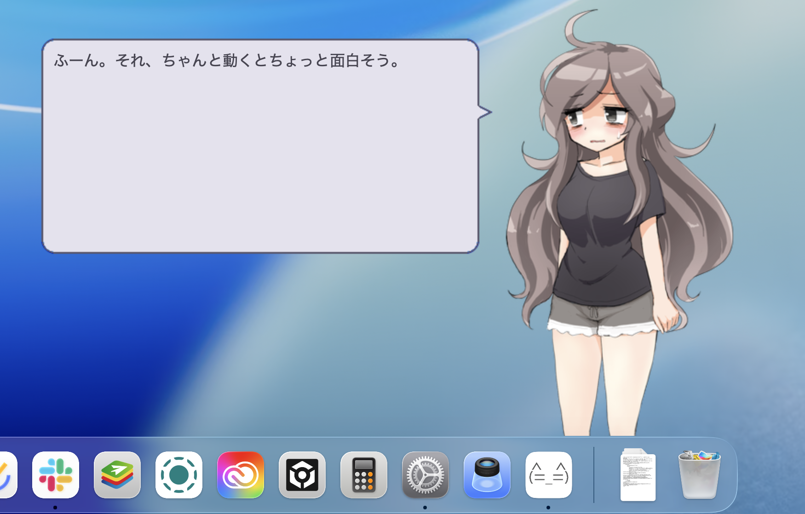

# Utatane / 転寝

Utataneは、伺かをmacOSで動かすための本体アプリです。



まだ開発中です。既存ゴーストとの互換性を地道に増やしています。SSP全部入りではありません。

Supported Languages: 日本語 / English / 简体中文 / 繁体中文 / 한국어

## だいたいできること

### ゴーストの表示と会話

- ゴースト、シェル、バルーンの読み込みと切り替え
- 複数キャラクター、サーフェス、SERIKOアニメーションの表示
- SakuraScriptによる会話、選択肢、リンクの再生
- クリック、ダブルクリック、撫で、ホイールなどのマウス操作
- 複数ゴーストの呼び出しとコミュニケーション
- キャラクターとバルーンの位置、選択中のシェルとバルーンをゴーストごとに保存
- キャラクターのドラッグ中は半透明になり、座標と移動量を表示（バルーンも追従）

### インストールと設定

- NARのファイル選択、ドラッグ＆ドロップ、Finderからの「このアプリケーションで開く」によるインストール
- 展開済みSSPフォルダからのゴーストとバルーンの取り込み
- シェルとバルーンの個別倍率、連動倍率、バルーン文字倍率
- シェルの画面下固定と画面端補正をゴーストごとに切り替え
- 前回のゴースト、起動時選択、ランダムの3種類の起動方法
- システム設定に従う／ライト／ダークの外観切り替え
- ゴースト起動やシェル切り替えに時間がかかる場合の進行表示

### 人格とかネットワークとか

- YAYA(文) / KAGARI / SHIOLINK(MiyoJS等) / 里々 / 華和梨 / 美坂 / 灯をSHIORIとして使うゴーストのネイティブ実行 (蒼空については"実験的な機能"を参照)
- SSU、`saori_cpuid`、`kenonoke`、`textcopy2`、`mciaudior`、`wmove`のネイティブSAORI互換
- ゴーストとバルーンの手動ネットワーク更新と、設定した日数ごとの自動更新
- SSTP over HTTP、RSS / Atom、HEADLINE/2.0
- `config.txt`形式のHEADLINEセンサーをネイティブ実行し、独自Windows DLLはWineへフォールバック
- Materiaの「さくら」をWineなしで実行
- プラグインの利用（ネイティブ対応SHIORIおよびmacOS向けにビルドされたdylibを使用するプラグインのみ）
- カレンダー

<details>
<summary>実験的な機能</summary>

- 利用者がビルドした蒼空のmacOS用モジュールを外部から読み込めます
- OpenAI Realtime APIまたは互換APIへ接続するリアルタイム音声会話
- ゴーストのAI連携

詳しくは[Native SHIORI / SAORI](Docs/Native-SHIORI.md)を参照してください。

</details>

## まだ無理なこと

今のところは以下の通り。

- 一般のWindows向けSHIORI / SAORI / プラグインDLLやexeは直接実行できません (wine設定で利用可)
- Windows固有のFMOには対応していません
- SakuraScript、SERIKO、着せ替えなどは未対応の命令や定義があります
- ネットワーク更新はゴーストと単体バルーンが対象です。SSPの修復モードや、別配布のシェル・バルーンをまとめて更新する機能には未対応です
- ゴーストによっては表示、文字コード、イベントの互換性に問題があります

## とりあえず使う

1. [Releases](../../releases)から最新のpre-releaseにある`Utatane-macOS.zip`をダウンロードする
2. ZIPを展開し、`Utatane.app`を「アプリケーション」フォルダへ移動する
3. Utataneを起動する

初回起動時から、同梱ゴースト「りあ」と専用バルーン「Ria」を利用できます。りあは時間帯や曜日に応じた会話、マウス操作、着せ替え、短い外出、現在地の天気確認などに対応しています。

現在のpre-releaseは未署名です。macOSに止められたら、一度起動を試してから「システム設定」→「プライバシーとセキュリティ」で許可してください。アプリケーションのディレクトリで`sudo xattr -rc Utatane.app`でも構いません。

## ほかのゴーストを追加する

同梱のりあ以外にも、次の方法でゴーストやバルーンを追加できます。

- 配布されているゴーストのNARをインストールする
- 展開済みのSSPフォルダから`ghost`と`balloon`を取り込む
- UtataneのコンテンツフォルダをFinderで表示する

SSPから持ってくる場合は、SSP本体のZIPを展開して、そのフォルダを「SSPフォルダから取り込む」で選びます。同名のものは上書きしません。

インストールしたコンテンツは次の場所に保存されます。

```text
~/Library/Application Support/Utatane/Ghosts
~/Library/Application Support/Utatane/Balloons
~/Library/Application Support/Utatane/Headline
```

<details>
<summary>元祖さくらとうにゅうを動かす</summary>

これは一般のWindowsゴースト互換機能ではなく、Materia付属のfirst(さくら)専用です。Utataneはfirstのファイルを同梱していないため、正規に入手したfirstを利用者自身で用意してください。対応版の`first.dll`は実行せず、必要な会話データを起動時に読み取るのでWineは不要です。

1. Utataneを一度起動し、右クリックメニューからコンテンツフォルダをFinderで開く
2. Materiaに付属するFIRSTを、次の構成になるようコピーする

   ```text
   ~/Library/Application Support/Utatane/Ghosts/first/
   ├── descript.txt
   ├── ghost/master/
   │   ├── descript.txt
   │   ├── first.dll
   │   └── var/first.txt（あれば初期値として参照）
   └── shell/master/...
   ```

3. 必要なバルーンも`~/Library/Application Support/Utatane/Balloons/`へコピーする
4. ゴースト一覧からさくらを選択する

現在ネイティブ対応しているのは、Utataneが解析・検証したオリジナル版FIRSTの`first.dll`です。別版の場合は誤ったセリフを組み立てないよう起動を拒否します。配布版にはMateria用のWine互換ホストを同梱しません。

ソースからのDebugビルドでは、ローカル検証データを次のように配置します。

```text
Content/Local/
└── Ghosts/first/
```

ネイティブ経路は元の`first.dll`や`var/first.txt`を書き換えません。眠気に関係する値など、Utatane上で変化した状態は`~/Library/Application Support/Utatane/State/FIRST/`へ別保存します。現時点の対応範囲と技術的な制約は[Native SHIORI / SAORI](Docs/Native-SHIORI.md)を参照してください。

</details>

## もう少し詳しい話

- [変更履歴](CHANGELOG.md)
- [開発・ビルド](Docs/Development.md)
- [ゴースト互換状況](Docs/Compatibility.md)
- [Native SHIORI / SAORI](Docs/Native-SHIORI.md)
- [Realtime音声会話](Docs/Realtime-Voice.md)
- [SakuraScript対応状況](Docs/UKADOC-SakuraScript-Compatibility.md)
- [SHIORI対応状況](Docs/UKADOC-SHIORI-Event-Compatibility.md)

## ライセンス

Utatane本体は[MIT License](LICENSE)で公開しています。

submoduleのYAYAはBSD 3-Clause License、SATORIはBSD 2-Clause License、KAWARIは修正BSD License、KAGARIはMIT Licenseです。ゴースト、シェル、バルーンは各配布元のルールに従ってください。

同梱ゴースト「りあ」のシェルには、ボトル猫さんの「p016（寝不足）」を使用しています。専用バルーン「Ria」は、ろすえんさんの「[something like Template](https://github.com/lost-nd-xxx/something_like_balloon)」を元に制作しています。詳しい規約とクレジットは、それぞれの同梱READMEを参照してください。
